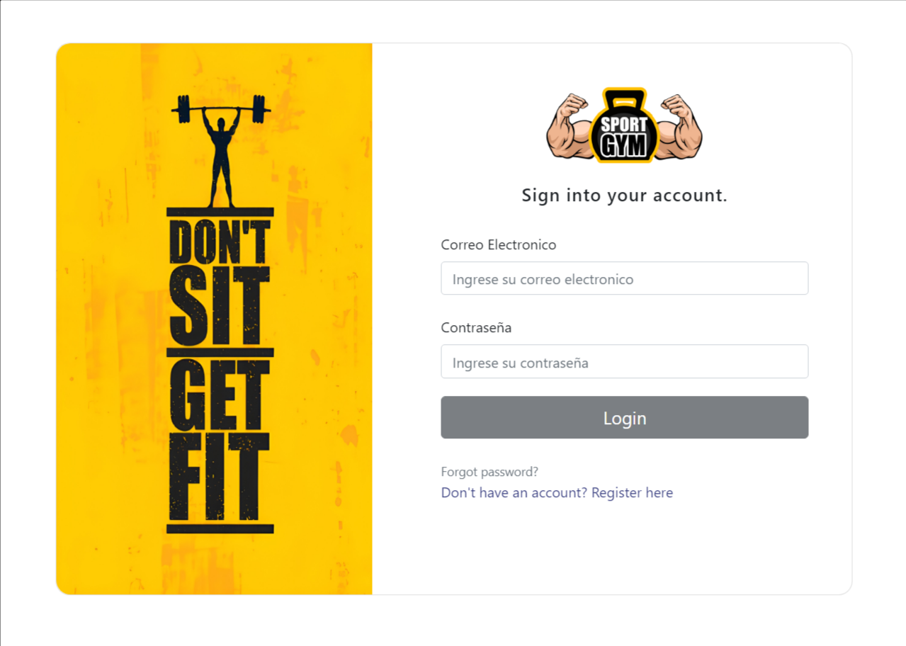

# SportGymApp

This project was generated with [Angular CLI](https://github.com/angular/angular-cli) version 12.2.18.

### DEMO: [SportGym App](https://sportgym.netlify.app/)

### _Demo account:_
- demo@demo.com 
- password: **123456**



## Implemented Dependencies: 
* Bootstrap
```
  npm i bootstrap@v4.6.2
```
* Ngx-Bootstrap
```
ng add ngx-bootstrap
```
* AngularFire
```
ng add @angular/fire
```
* Ngx-Spinner
```
  npm i ngx-spinner@12.0.0
```
* SweetAlert2
```
npm install sweetalert2
```

## Note: 
### Install dependencies for running this project
```
npm install
```